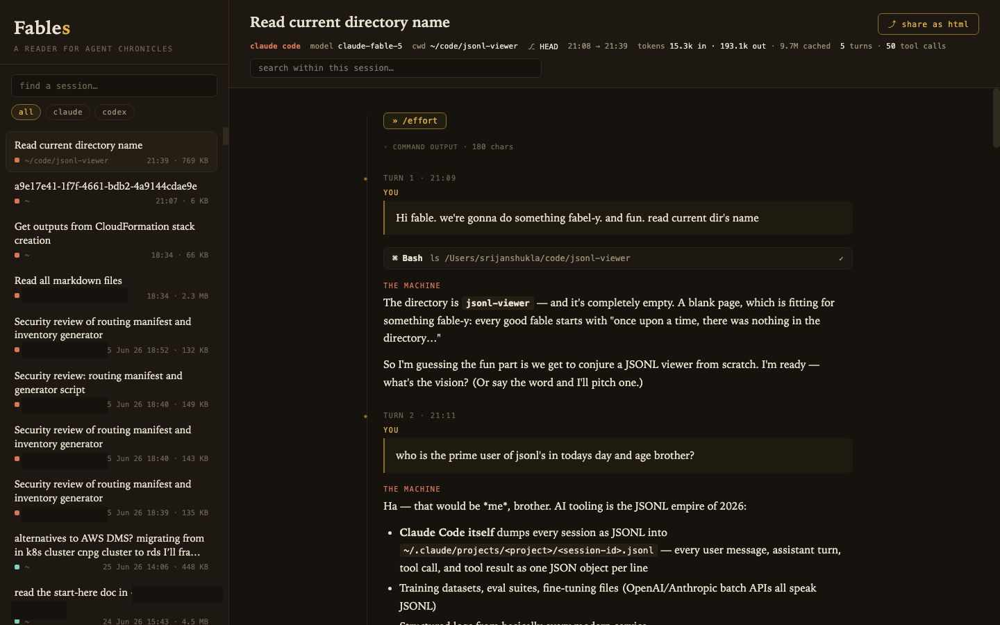

# Fables

**A local reading room for coding-agent chronicles.** Fables discovers the
conversation stores already on your machine and renders them as readable,
searchable sessions.



## Install

Fables can install itself as a per-user background service. It starts whenever
you log in, stays bound to your own machine at `http://localhost:8321`, and does
not require `sudo`.

```bash
git clone https://github.com/srijanshukla18/fables
cd fables
./install.sh
```

The installer copies Fables to `~/.local/share/fables`, adds the control command
at `~/.local/bin/fables`, starts it immediately, and opens it in your browser.
It uses a LaunchAgent on macOS and a systemd user service on Linux. Python 3.10
or newer is the only runtime requirement.

If `~/.local/bin` is not already on your `PATH`, add it in your shell profile:

```bash
export PATH="$HOME/.local/bin:$PATH"
```

Control the installed service with:

```bash
fables open       # open the reading room
fables status     # inspect the background service
fables restart    # restart after troubleshooting
fables logs       # follow service logs
fables stop       # stop until the next login or explicit start
fables start
fables uninstall  # remove the service and installed application
```

To use another port, pass it during installation. Running the installer again
is safe and updates the installed copy in place.

```bash
./install.sh --port 3000
```

To update later, pull the latest source in the original clone and rerun the
installer:

```bash
git pull --ff-only
./install.sh
```

Fables runs only while your user session is active. It does not install a
machine-wide daemon or enable Linux user lingering. On Linux, a systemd user
session is required.

## Run without installing

No packages, build step, account, or configuration are required:

```bash
python3 serve.py
# open http://localhost:8321
```

Use `python3 serve.py 3000` to choose another port.

## Supported sources

| Source | Local store | Status |
| --- | --- | --- |
| Claude Code | `~/.claude/projects/**/*.jsonl` | Stable |
| Codex | `~/.codex/sessions/**/*.jsonl`, `~/.codex/archived_sessions/*.jsonl` | Stable |
| pi | `~/.pi/agent/sessions/**/*.jsonl` | Stable |
| Prime Agent | `~/.prime/agent/sessions/*.jsonl` | Stable |
| Command Code | `~/.commandcode/projects/**/*.jsonl` (+ `.meta.json`) | Stable |
| Gemini CLI | `~/.gemini/tmp/*/chats/session-*.json*` | Stable |
| Cline | `~/.cline/data/tasks/*` and editor extension storage | Stable |
| Roo Code | VS Code, Cursor, and Windsurf extension storage | Stable |
| Goose | `~/Library/Application Support/Block/goose/sessions/sessions.db` or its Linux equivalent | Stable |
| VS Code Chat | workspace, empty-window, and transferred chat sessions | Stable |
| Claude Cowork | legacy local-agent sandboxes | Experimental |
| GitHub Copilot CLI | `~/.copilot/session-state/*/events.jsonl` | Stable |
| Cursor | `state.vscdb` composer and bubble records | Experimental |
| Cursor CLI | `~/.cursor/projects/*/agent-transcripts/`, also `~/.agent/`, `~/.agents/` | Stable |
| Kimi CLI | `~/.kimi/sessions/*/*/context.jsonl` (+ `wire.jsonl` for tool calls) | Stable |
| Command Code | `~/.commandcode/projects/**/*.jsonl` (+ `.meta.json`) | Stable |
| Amp | `~/.local/share/amp/threads/*.json` | Experimental |
| Qwen Code | `~/.qwen/tmp/*/chats/*.jsonl` | Stable |
| Aider | `.aider.chat.history.md` in project roots under `~/code`, `~/projects`, `~/src`, `~/work`, `~/repos` | Stable |
| Trae | `~/Library/Application Support/Trae/User/` (workspace chats + `chat.ChatSessionStore` index) | Experimental |
| Kiro | `~/.kiro/sessions/cli/*.jsonl` (ACP logs) | Stable |
| Kilo Code | editor global-storage tasks (like Cline/Roo) | Stable |
| Zed | `~/Library/Application Support/Zed/threads/threads.db` (zstd blobs) | Experimental |
| OpenCode | current SQLite and legacy JSON storage | Experimental |

Experimental means the application's local schema is undocumented, migrating,
or both. Fables reports provider-level discovery failures instead of hiding
them. Current account-backed Cowork sessions may not have a local transcript
and therefore may not appear.

## Agents: stateless MCP server

Fables also speaks MCP (Model Context Protocol, [2026-07-28 stateless
spec](https://modelcontextprotocol.io/specification/2026-07-28)) over stdio,
so any MCP-capable agent — Codex CLI, Claude Code, pi — can list, fetch, and
search the same sessions without knowing any provider's on-disk format. The
server is stateless: no initialize handshake, no protocol sessions, every
request self-contained, so it can be restarted or load-balanced freely.

Run it directly, or through the control command after install:

```bash
python3 fables-mcp.py
fables mcp
```

### Register with every agent

```bash
python3 install-mcp.py     # or: fables mcp-install
python3 install-mcp.py --check    # report status without writing
python3 install-mcp.py --remove   # unregister everywhere
```

The installer registers fables-mcp (launched via `uv run`) with every
MCP-capable agent Fables reads: Codex CLI, Claude Code, Gemini CLI, Cursor,
OpenCode, Cline, Roo Code, VS Code Chat, Goose, Copilot CLI, Command Code
(`cmd mcp add`), Amp (`amp mcp add`), Qwen Code, Trae, Kiro, Kilo Code, Zed,
Prime Agent (HTTP endpoint + kernel skill, since its kernel only wires HTTP
MCP servers), and pi (as a pi extension bridge, since pi has no built-in MCP
client). Aider is read but not registered — it has no native MCP client
support. Each target is idempotent and gets a one-shot
`<file>.fables.bak` backup before any write.

Register with Codex CLI manually in `~/.codex/config.toml`:

```toml
[mcp_servers.fables]
command = "fables"
args = ["mcp"]
```

Tools:

- `list_sessions` — newest sessions, filterable by source and by a query
  over title, cwd, opaque id, and native provider id (for example a pi UUID)
- `get_session` — the conversation as readable text. **By default only user
  and assistant messages are returned** (compact, resume-friendly context);
  pass `include_thinking: true` for reasoning blocks, `include_tools: true`
  for tool calls with arguments and tool results (the flags are independent),
  or `format: "json"` for the raw archive. `id` accepts the opaque hash
  from `list_sessions`, a native provider id, or `source:native_id`
  (for example `pi:019ffc61-...`)
- `search_sessions` — case-insensitive search over recent transcripts
  (messages by default; `include_thinking: true` also searches reasoning,
  `include_tools: true` also searches tool content). Native provider ids
  and opaque hashes match without scanning transcripts.

Resume across agents: end a session in pi, open Codex, and ask it to
`get_session` with the pi UUID (or `list_sessions` with `source: "pi"`),
then continue the work in a fresh session.

pi gets the same tools through `~/.pi/agent/extensions/fables-mcp.ts` (installed
by install-mcp.py): `fables_list_sessions`, `fables_get_session`, and
`fables_search_sessions` appear as native pi tools on the next pi launch.

## Cloud: every machine, every harness, one library

`cloud/fables-cloud.py` hosts your sessions centrally (Google sign-in, device
tokens, sqlite), and `fables-sync.py` pushes each machine's sessions to it, so
any MCP-capable agent on any machine can reach any session. Deploy on AWS
Lightsail with `cloud/deploy-aws.sh` (Docker + Caddy auto-TLS).

```bash
# on every machine, as a daemon:
python3 fables-sync.py --url https://fables.example.com \
    --token <device-token> --watch 600
```

Sign in at `https://fables.example.com` with your Google account to mint the
device token, then point HTTP-capable agents (Prime, Zed, Kiro, Goose, …) at
`https://fables.example.com/mcp` with `Authorization: Bearer <token>`.

## Reading and searching

- Filter the library by source or search titles and projects.
- Search within a session across the complete normalized transcript, including
  passages that have not yet been rendered.
- Expand thinking, tool calls, results, injected context, and source records.
- See model changes, reasoning effort, token totals, tool status, and parse
  diagnostics where the source recorded them.
- Use browser back/forward for session history. Press `/` to search, `j`/`k`
  for the next/previous visible session, or `Cmd/Ctrl-K` for library search.

Large sessions are parsed in a Web Worker and rendered incrementally so the
reading room stays responsive.

## Sharing safely

Choose **share as html** to review and download a single offline HTML file.
Exports contain a normalized Fables archive, not the original transcript.

Reasoning, system context, and raw records are excluded by default. Before
exporting, Fables scans for likely credentials, local paths, and email
addresses, then lets you choose categories and redactions. Tool calls and
outputs are included by default because they are part of the visible story.

Secret detection is best-effort, not a security boundary. Always inspect the
preview and treat exported files as potentially sensitive.

## Privacy and security

- The server binds only to `127.0.0.1` and rejects non-local `Host` headers.
- Browser-visible session IDs are opaque hashes; clients cannot request paths.
  MCP `get_session` also accepts native provider ids (UUIDs printed by pi,
  Cursor, and others), which are not filesystem paths.
- SQLite stores are opened read-only with bounded, session-specific queries.
- HTTP responses use restrictive content security and MIME-sniffing headers.
- Nothing is uploaded, and the runtime has no third-party dependencies.

The viewer still reads transcripts containing prompts, code, commands, file
contents, paths, and potentially secrets. Anyone with access to the local
server or an exported file can read the data shown there.

## Architecture

- `providers.py` discovers stores and converts database-backed sessions to
  bounded synthetic archives.
- `serve.py` is the local stdlib HTTP boundary.
- `fables-mcp.py` is the stateless stdio MCP server for agents.
- `fables-core.js` normalizes every provider and builds privacy-aware exports.
- `fables-worker.js` parses sessions off the main thread.
- `fables-app.js` and `fables.css` implement the dependency-free reader.

## Tests

```bash
python3 -m unittest discover -s tests -v
node --test tests/test_core.js
```

The fixtures are synthetic and sanitized; they cover every supported provider,
SQLite extraction, mutation-log replay, malformed input, tool pairing,
redaction, and HTTP boundary behavior.

## Lineage

Spiritual successor to
[claude-memory-viz](https://github.com/srijanshukla18/claude-memory-viz):
clone, one command, zero config.

MIT.
